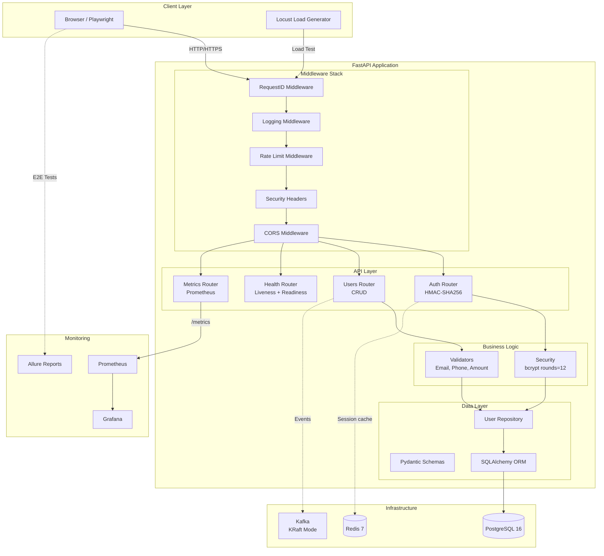
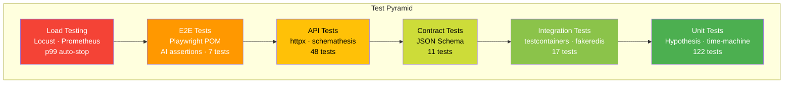

<div align="center">

# 🎯 QUALIX

**Production-grade QA automation platform**

[🇬🇧 English](README.md) | [🇷🇺 Русский](README.ru.md)

[](https://github.com/ssrjkk/qualix/actions)
[](https://codecov.io/gh/ssrjkk/qualix)
[](https://python.org)
[](https://pytest.org)
[](https://github.com/astral-sh/ruff)
[](https://github.com/PyCQA/bandit)
[](LICENSE)

[Quick Start](#-quick-start) • [Architecture](#-architecture) • [Tests](#-test-layers) • [Docs](#-documentation)

**Sergey Sitnikov** · QA Automation Engineer · [Telegram](https://t.me/ssrjkk)

</div>

---

## 📋 What's Inside?

qualix is not just a test suite. It's a **complete product** for monitoring API and UI degradation with production-grade architecture.

<table>
<tr>
<td width="50%">

### 🏗️ Application
- FastAPI + HMAC-SHA256 auth
- bcrypt (rounds=12, OWASP)
- Rate limiting + Security headers
- Prometheus metrics
- Kubernetes-ready

</td>
<td width="50%">

### 🧪 Testing
- 317 tests, 100% coverage
- Full test pyramid
- Hypothesis property-based
- Playwright E2E + AI assertions
- Locust load testing

</td>
</tr>
</table>

## 🚀 Quick Start

```bash
# 1. Clone
git clone git@github.com:ssrjkk/qualix.git && cd qualix

# 2. Install dependencies
make setup

# 3. Start infrastructure (optional)
make up

# 4. Run tests
make test          # full suite
make cov           # coverage report
```

<details>
<summary><b>📦 What gets installed?</b></summary>

- ✅ All dependencies from `pyproject.toml`
- ✅ Pre-commit hooks (ruff, mypy, bandit)
- ✅ Playwright chromium browser
- ✅ 20+ Makefile commands

</details>

## 💡 Use Cases

### For QA Engineers
**Learn modern testing practices:**
- Study the full test pyramid: unit → integration → API → contract → E2E → load
- See real-world examples of `Hypothesis` property-based testing (500+ cases per validator)
- Learn `Playwright` Page Object Model with AI-powered assertions
- Understand `pytest-benchmark` for performance regression detection

**Use as a reference implementation:**
- Copy patterns for your own projects: factory_boy, time-machine, fakeredis
- Adapt the flaky test tracker plugin for automatic GitHub Issue creation
- Reuse the security hardening checklist (see [SECURITY.md](SECURITY.md))

### For DevOps Engineers
**Production-ready deployment patterns:**
- Kubernetes manifests with HPA, rolling updates, health probes
- Prometheus + Grafana monitoring stack (dashboard included)
- Docker multi-stage build with security scanning (Trivy)
- 17-job CI/CD pipeline with quality gates

**Infrastructure as code examples:**
- `infra/k8s/` — deployment, service, HPA, secrets
- `infra/prometheus.yml` — scrape configs for app + dependencies
- `infra/grafana/` — pre-configured dashboard with 6 panels

### For Developers
**FastAPI best practices:**
- Clean architecture: repository pattern, dependency injection, layered structure
- Middleware stack: RequestID, logging, rate limiting, security headers
- HMAC-SHA256 authentication with constant-time verification
- bcrypt password hashing (OWASP compliant)

**Type-safe code:**
- mypy strict mode enabled
- Pydantic validation for all request/response models
- Decimal for monetary values (no float precision issues)

### For Security Researchers
**Defense-in-depth implementation:**
- Custom token auth with timing attack protection
- Strict password policy enforcement
- CORS per-environment (production: no origins, dev: localhost only)
- Rate limiting: sliding window, bounded memory
- Security headers on every response

**Audit the code:**
- No secrets in repository (environment variables only)
- Bandit SAST + Safety dependency scan in CI
- pre-commit hooks for private key detection
- See [SECURITY.md](SECURITY.md) for full security policy

## 🏛️ Architecture



<details>
<summary><b>🔍 Component details</b></summary>

**Middleware Stack** (execution order):
1. `RequestIDMiddleware` — generates `X-Request-ID` for distributed tracing
2. `LoggingMiddleware` — structlog JSON logging with request_id
3. `RateLimitMiddleware` — sliding window, 100 req/min per IP
4. `SecurityHeadersMiddleware` — X-Frame-Options, X-Content-Type-Options, etc.
5. `CORSMiddleware` — per-environment origins

**API Endpoints**:
- `POST /api/v1/auth/login` — HMAC-SHA256 token
- `GET/POST/PUT/DELETE /api/v1/users` — CRUD operations
- `GET /health` — liveness probe (k8s)
- `GET /health/ready` — readiness probe (k8s)
- `GET /metrics` — Prometheus metrics

</details>

## 🧪 Test Layers



| Layer | Tests | Tools | What it validates |
|-------|-------|-------|-------------------|
| **Unit** | 122 | pytest · Hypothesis · time-machine · benchmark | Validators, models, auth internals |
| **Integration** | 17 | testcontainers · fakeredis · SQLite | Repository pattern, DB ops |
| **API** | 48 | httpx · factory_boy · schemathesis | CRUD, auth flows, OpenAPI fuzzing |
| **Contract** | 11 | JSON Schema | API contracts, security constraints |
| **E2E** | 7 | Playwright POM · AI assertions | Login flow, UI interactions |
| **Load** | - | Locust · Prometheus · p99 auto-stop | Performance, latency, throughput |
| **Total** | **317** | | **100% coverage** |

<details>
<summary><b>🎯 Key testing features</b></summary>

**Data generation**:
- `factory_boy` — `UserCreateFactory`, `UserPayloadFactory` with traits
- `Hypothesis` — 500+ property-based cases for validators
- `Faker` — realistic test data

**Time control**:
- `time-machine` — deterministic token expiry tests
- `pytest-benchmark` — performance regression for bcrypt, token ops

**Isolation**:
- `fakeredis` — Redis tests without Docker
- `SQLite fallback` — tests without PostgreSQL
- `AsyncMock` — mocks for unit tests

**AI-powered**:
- `Claude Sonnet` — semantic UI assertions in E2E
- `Flaky tracker` — automatic GitHub Issue creation

</details>

## 🛡️ Security

qualix implements **defense-in-depth**:

<table>
<tr>
<td width="33%">

### 🔐 Authentication
- HMAC-SHA256 tokens
- Constant-time verification
- bcrypt (rounds=12)
- Strict password policy

</td>
<td width="33%">

### 🌐 Network
- Security headers
- CORS per-environment
- Rate limiting (100 req/min)
- Request ID tracking

</td>
<td width="33%">

### 🏗️ Infrastructure
- Bandit SAST
- Safety dependency scan
- Trivy container scan
- Dependabot weekly

</td>
</tr>
</table>

<details>
<summary><b>📊 Security checklist</b></summary>

**Authentication**:
- ✅ Custom HMAC-SHA256 tokens with constant-time comparison
- ✅ bcrypt password hashing (OWASP compliant)
- ✅ Strict password policy: uppercase + lowercase + digit + special character
- ✅ Empty token rejection

**Network**:
- ✅ Security headers: X-Frame-Options, X-Content-Type-Options, Referrer-Policy, Permissions-Policy
- ✅ CORS per-environment (production: no origins, dev: localhost only)
- ✅ Rate limiting: 100 req/min per IP, sliding window, bounded memory

**Data**:
- ✅ No secrets in code (environment variables + sealed-secrets)
- ✅ Decimal for money (PaymentRequest.amount uses Decimal)
- ✅ SQL injection prevention (SQLAlchemy ORM)

**CI/CD**:
- ✅ Bandit SAST + Safety dependency scan
- ✅ Trivy container scanning
- ✅ Dependabot weekly updates
- ✅ pre-commit hooks (bandit + detect-private-key)

Learn more: [SECURITY.md](SECURITY.md)

</details>

## 📊 Monitoring

```bash
# Prometheus metrics
curl http://localhost:8080/metrics

# Grafana dashboard
open http://localhost:3000  # admin:changeme

# Allure reports
open http://localhost:4040
```

**Grafana dashboard** includes:
- HTTP request rate by status
- Latency percentiles (p50, p95, p99)
- Error rate (5xx)
- App version and environment

## 📚 Documentation

| Resource | Description |
|----------|-------------|
| [CONTRIBUTING.md](CONTRIBUTING.md) | How to contribute |
| [SECURITY.md](SECURITY.md) | Security policy |
| [CHANGELOG.md](CHANGELOG.md) | Change history |
| [docs/adr/](docs/adr/) | Architecture Decision Records |
| [docs/case-studies/](docs/case-studies/) | Postmortems and lessons learned |

### ADR (Architecture Decision Records)

- [001](docs/adr/001-custom-token-vs-jwt.md) — Why custom tokens instead of JWT
- [002](docs/adr/002-sqlite-fallback-for-tests.md) — Why SQLite fallback
- [003](docs/adr/003-bcrypt-for-passwords.md) — Why bcrypt instead of SHA-256
- [004](docs/adr/004-fakeredis-in-tests.md) — Why fakeredis instead of mocks
- [005](docs/adr/005-json-schema-contracts-vs-pact.md) — Why JSON Schema instead of Pact

## 🔧 Commands

<details>
<summary><b>📋 All Makefile commands</b></summary>

```bash
# Tests
make test              # full suite
make test-unit         # unit + coverage
make test-integration  # integration (fakeredis + SQLite)
make test-api          # API + schemathesis
make test-contract     # JSON Schema contracts
make test-e2e          # Playwright (requires make up)
make test-load         # Locust 30s smoke

# Coverage
make cov               # term + html + xml
make cov-open          # open html in browser

# Quality
make lint              # ruff + mypy
make fmt               # auto-formatting
make security-scan     # SAST + dependency scan

# CI
make ci                # lint + unit + integration + api + contract

# Dev environment
make setup             # full setup (deps + pre-commit)
make install           # dependencies only
make pre-commit        # check all files

# Utilities
make changelog         # update CHANGELOG from git-cliff
make schema            # regenerate openapi.json
make clean             # remove artifacts
```

</details>

## 🚢 CI/CD

**17-job GitHub Actions pipeline**:

```
lint → unit (+codecov) → integration → api → contract → e2e → allure → 
coverage-badge → docker → staging → load → release
```

- ✅ **Coverage enforcement** — `fail_under=80`, branch coverage
- ✅ **Zero-downtime deploy** — k8s RollingUpdate + `maxUnavailable=0`
- ✅ **HPA** — autoscaling by CPU/Memory (min=2, max=10)
- ✅ **Dependabot** — weekly updates for pip, Docker, GitHub Actions

<details>
<summary><b>🔍 Kubernetes manifests</b></summary>

```yaml
infra/k8s/
├── namespace.yaml
├── deployment.yaml      # RollingUpdate, liveness/readiness probes
├── service.yaml         # ClusterIP
├── hpa.yaml             # CPU + memory autoscaling
├── configmap.yaml       # Environment variables
└── sealed-secret.yaml   # Encrypted secrets (kubeseal)
```

</details>

## 📦 Project Structure

<details>
<summary><b>🌳 Show tree</b></summary>

```
qualix/
├── app/                          # FastAPI SUT
│   ├── api/                      # Routes: auth, users, health, metrics
│   ├── models/                   # SQLAlchemy ORM + Pydantic schemas
│   ├── repositories/             # Data access layer
│   ├── services/                 # Business logic validators
│   ├── middleware.py             # RequestID · Logging · RateLimit · Security
│   ├── security.py               # bcrypt password hashing
│   ├── logging_config.py         # structlog structured logging
│   ├── dependencies.py           # FastAPI DI
│   └── config.py                 # pydantic-settings
│
├── tests/
│   ├── unit/                     # 122 tests (Hypothesis, time-machine)
│   ├── integration/              # 17 tests (testcontainers, fakeredis)
│   ├── api/                      # 48 tests (httpx, schemathesis)
│   ├── contract/                 # 11 tests (JSON Schema)
│   ├── e2e/                      # 7 tests (Playwright POM)
│   ├── load/                     # Locust + Prometheus
│   └── plugins/                  # Flaky tracker
│
├── infra/
│   ├── k8s/                      # Kubernetes manifests
│   ├── prometheus.yml            # Scrape configs
│   └── grafana/                  # Dashboard provisioning
│
├── docs/adr/                     # Architecture Decision Records
├── .github/workflows/ci.yml      # 17-job pipeline
├── docker-compose.yml            # 7 services
├── Makefile                      # 20+ commands
└── pyproject.toml                # Dependencies + tool configs
```

</details>

## 🤝 Contributing

1. Fork the repo
2. Create a feature branch (`git checkout -b feature/amazing`)
3. Run tests (`make ci`)
4. Commit changes (`git commit -m 'feat: add amazing feature'`)
5. Push (`git push origin feature/amazing`)
6. Open a Pull Request

Learn more: [CONTRIBUTING.md](CONTRIBUTING.md)

## 📄 License

MIT © [ssrjkk](https://github.com/ssrjkk)

---

<div align="center">

**⭐ Star this repo if you found it useful!**

[GitHub](https://github.com/ssrjkk/qualix) · [Telegram](https://t.me/ssrjkk) · [Email](mailto:ray013lefe@gmail.com)

</div>
