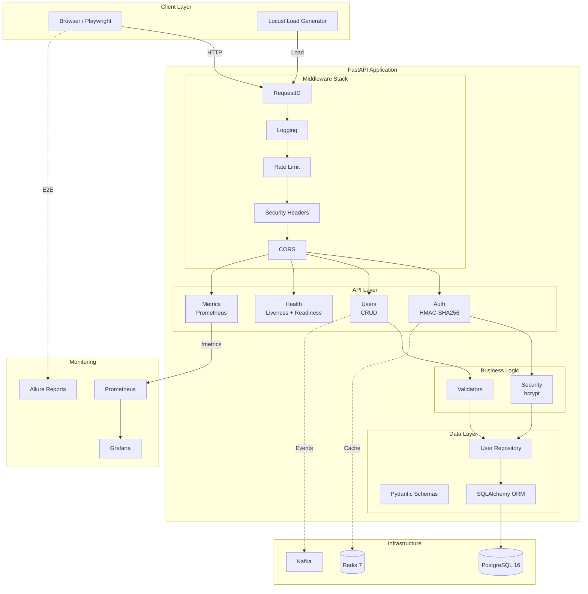
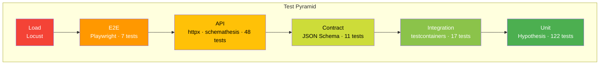

# QUALIX

QA automation platform for API and UI monitoring.

[English](README.md) | [Русский](README.ru.md)

## Overview

Qualix is a FastAPI application with a complete test pyramid — from unit tests to load testing. Built as a reference implementation for modern QA practices.

**Stack:** Python 3.12, FastAPI, SQLAlchemy, pytest, Playwright, Locust, Docker, Kubernetes

**Metrics:**
- 317 tests across 6 layers
- 85%+ code coverage
- 17-job CI/CD pipeline
- Full security hardening

## Quick Start

```bash
# Clone and setup
git clone git@github.com:ssrjkk/qualix.git
cd qualix
make setup

# Run tests
make test

# Start infrastructure (optional)
make up
```

`make setup` installs dependencies, pre-commit hooks, and Playwright browsers. No Docker required for unit/integration/API tests — SQLite and fakeredis provide local isolation.

## Use Cases

### QA Engineers

**Learn modern testing:**
- Full test pyramid: unit → integration → API → contract → E2E → load
- Property-based testing with Hypothesis (500+ cases per validator)
- Playwright Page Object Model with AI-powered assertions
- Performance regression detection with pytest-benchmark

**Reuse patterns:**
- factory_boy for test data generation
- time-machine for deterministic time-dependent tests
- fakeredis for Redis testing without Docker
- Flaky test tracker plugin (auto-creates GitHub Issues)

### DevOps Engineers

**Deployment patterns:**
- Kubernetes manifests with HPA, rolling updates, health probes
- Prometheus metrics + Grafana dashboards (pre-configured)
- Docker multi-stage build with Trivy security scanning
- Zero-downtime deployments (maxUnavailable=0)

**Infrastructure:**
- `infra/k8s/` — deployment, service, HPA, secrets
- `infra/prometheus.yml` — scrape configs
- `infra/grafana/` — dashboard provisioning

### Developers

**FastAPI architecture:**
- Repository pattern with dependency injection
- Middleware stack: RequestID, logging, rate limiting, security headers
- HMAC-SHA256 authentication with constant-time verification
- bcrypt password hashing (rounds=12, OWASP compliant)

**Code quality:**
- mypy strict mode
- Pydantic validation for all models
- Decimal for monetary values (no float precision issues)
- structlog for structured JSON logging

### Security Researchers

**Defense in depth:**
- Custom HMAC-SHA256 tokens with timing attack protection
- Rate limiting: sliding window, 100 req/min per IP
- Security headers on every response (X-Frame-Options, CSP, etc.)
- CORS per environment (production: no origins allowed)

**Audit:**
- No secrets in code (environment variables only)
- Bandit SAST + Safety dependency scanning in CI
- pre-commit hooks for private key detection
- See [SECURITY.md](SECURITY.md) for full policy

## Architecture



**Middleware execution order:**
1. RequestIDMiddleware — generates X-Request-ID for tracing
2. LoggingMiddleware — structlog JSON logging with request context
3. RateLimitMiddleware — sliding window, 100 req/min per IP
4. SecurityHeadersMiddleware — X-Frame-Options, X-Content-Type-Options, etc.
5. CORSMiddleware — per-environment origins

**API endpoints:**
- `POST /api/v1/auth/login` — HMAC-SHA256 token
- `GET/POST/PUT/DELETE /api/v1/users` — CRUD operations
- `GET /health` — liveness probe
- `GET /health/ready` — readiness probe
- `GET /metrics` — Prometheus metrics

## Test Layers



| Layer | Tests | Tools | Coverage |
|-------|-------|-------|----------|
| Unit | 122 | pytest, Hypothesis, time-machine, benchmark | Validators, models, auth |
| Integration | 17 | testcontainers, fakeredis, SQLite | Repository pattern, DB ops |
| API | 48 | httpx, factory_boy, schemathesis | CRUD, auth flows, OpenAPI fuzzing |
| Contract | 11 | JSON Schema | API contracts, security constraints |
| E2E | 7 | Playwright POM, AI assertions | Login flow, UI interactions |
| Load | - | Locust, Prometheus | Performance, latency, throughput |
| **Total** | **317** | | **85%+** |

**Testing tools:**
- **factory_boy** — test data generation with traits
- **Hypothesis** — property-based testing (500+ cases)
- **time-machine** — deterministic time-dependent tests
- **fakeredis** — Redis testing without Docker
- **pytest-benchmark** — performance regression detection
- **Flaky tracker** — custom plugin for GitHub Issue creation

## Security

**Authentication:**
- HMAC-SHA256 tokens with constant-time verification
- bcrypt password hashing (rounds=12)
- Strict password policy: uppercase + lowercase + digit + special character
- Empty token rejection

**Network:**
- Security headers: X-Frame-Options, X-Content-Type-Options, Referrer-Policy, Permissions-Policy
- CORS per environment (production: no origins, dev: localhost only)
- Rate limiting: 100 req/min per IP, sliding window, bounded memory
- Rate limit headers on all responses (X-RateLimit-Limit, X-RateLimit-Remaining, X-RateLimit-Reset)

**Infrastructure:**
- Bandit SAST + Safety dependency scanning
- Trivy container scanning
- Dependabot weekly updates
- pre-commit hooks (bandit, detect-private-key)

Full details: [SECURITY.md](SECURITY.md)

## Monitoring

```bash
# Prometheus metrics
curl http://localhost:8080/metrics

# Grafana dashboard
open http://localhost:3000  # admin:changeme

# Allure reports
open http://localhost:4040
```

**Grafana dashboards:**
- HTTP request rate by status
- Latency percentiles (p50, p95, p99)
- Error rate (5xx)
- Application version and environment

## Documentation

| Resource | Description |
|----------|-------------|
| [CONTRIBUTING.md](CONTRIBUTING.md) | Contribution guidelines |
| [SECURITY.md](SECURITY.md) | Security policy |
| [CHANGELOG.md](CHANGELOG.md) | Version history |
| [docs/adr/](docs/adr/) | Architecture Decision Records |

**ADR highlights:**
- [Custom tokens vs JWT](docs/adr/001-custom-token-vs-jwt.md)
- [SQLite fallback for tests](docs/adr/002-sqlite-fallback-for-tests.md)
- [bcrypt vs SHA-256](docs/adr/003-bcrypt-for-passwords.md)
- [fakeredis vs mocks](docs/adr/004-fakeredis-in-tests.md)
- [JSON Schema vs Pact](docs/adr/005-json-schema-contracts-vs-pact.md)

## Commands

```bash
# Tests
make test              # full suite
make test-unit         # unit + coverage
make test-integration  # integration (fakeredis + SQLite)
make test-api          # API + schemathesis
make test-contract     # JSON Schema contracts
make test-e2e          # Playwright (requires make up)
make test-load         # Locust 30s smoke

# Coverage
make cov               # term + html + xml
make cov-open          # open html in browser

# Quality
make lint              # ruff + mypy
make fmt               # auto-formatting
make security-scan     # SAST + dependency scan

# CI
make ci                # lint + unit + integration + api + contract

# Dev environment
make setup             # full setup (deps + pre-commit)
make install           # dependencies only
make pre-commit        # check all files

# Utilities
make changelog         # update CHANGELOG from git-cliff
make schema            # regenerate openapi.json
make clean             # remove artifacts
```

## CI/CD

17-job GitHub Actions pipeline:

```
lint → unit (+codecov) → integration → api → contract → e2e → allure → 
coverage-badge → docker → staging → load → release
```

- Coverage enforcement: `fail_under=80`, branch coverage
- Zero-downtime deploy: k8s RollingUpdate, maxUnavailable=0
- HPA: autoscaling by CPU/memory (min=2, max=10)
- Dependabot: weekly updates for pip, Docker, GitHub Actions

## Project Structure

```
qualix/
├── app/                          # FastAPI application
│   ├── api/                      # Routes: auth, users, health, metrics
│   ├── models/                   # SQLAlchemy ORM + Pydantic schemas
│   ├── repositories/             # Data access layer
│   ├── services/                 # Business logic validators
│   ├── middleware.py             # RequestID, Logging, RateLimit, Security
│   ├── security.py               # bcrypt password hashing
│   ├── logging_config.py         # structlog configuration
│   ├── dependencies.py           # FastAPI dependency injection
│   └── config.py                 # pydantic-settings
│
├── tests/
│   ├── unit/                     # 122 tests (Hypothesis, time-machine)
│   ├── integration/              # 17 tests (testcontainers, fakeredis)
│   ├── api/                      # 48 tests (httpx, schemathesis)
│   ├── contract/                 # 11 tests (JSON Schema)
│   ├── e2e/                      # 7 tests (Playwright POM)
│   ├── load/                     # Locust + Prometheus
│   └── plugins/                  # Flaky tracker
│
├── infra/
│   ├── k8s/                      # Kubernetes manifests
│   ├── prometheus.yml            # Scrape configs
│   └── grafana/                  # Dashboard provisioning
│
├── docs/adr/                     # Architecture Decision Records
├── .github/workflows/ci.yml      # 17-job pipeline
├── docker-compose.yml            # 7 services
├── Makefile                      # 20+ commands
└── pyproject.toml                # Dependencies + tool configs
```

## Contributing

1. Fork the repository
2. Create a feature branch (`git checkout -b feature/amazing`)
3. Run tests (`make ci`)
4. Commit changes (`git commit -m 'feat: add amazing feature'`)
5. Push (`git push origin feature/amazing`)
6. Open a Pull Request

See [CONTRIBUTING.md](CONTRIBUTING.md) for details.

## License

MIT © [ssrjkk](https://github.com/ssrjkk)

---

**Author:** Sergey Sitnikov · QA Automation Engineer · [Telegram](https://t.me/ssrjkk)
