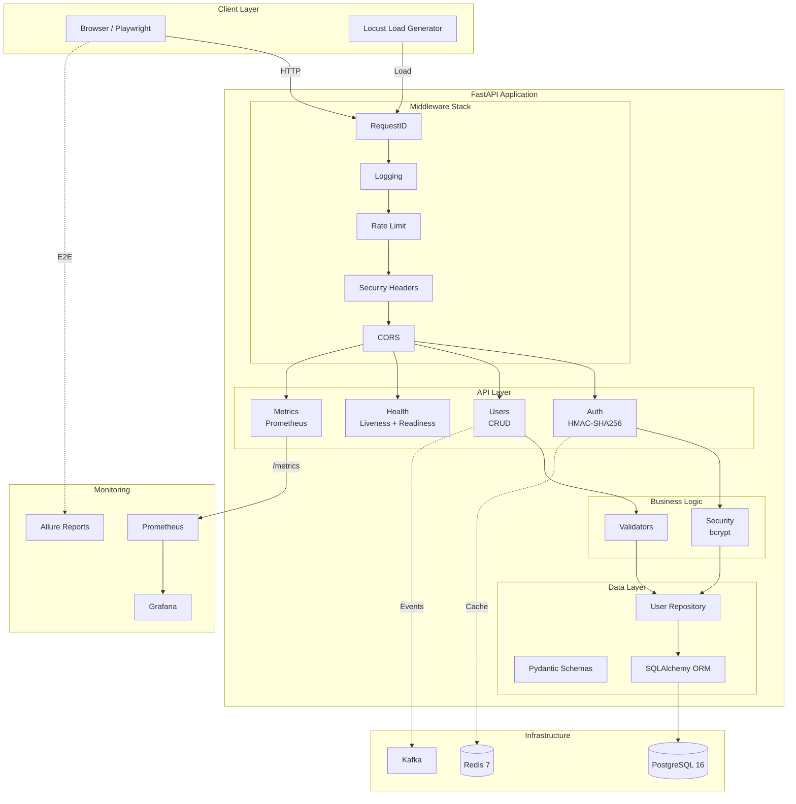
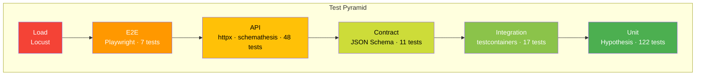

# QUALIX

QA-платформа для мониторинга деградации API и UI.

[English](README.md) | [Русский](README.ru.md)

## Обзор

Qualix — FastAPI-приложение с полной тест-пирамидой: от unit-тестов до нагрузочного тестирования. Построен как эталонная реализация современных QA-практик.

**Стек:** Python 3.12, FastAPI, SQLAlchemy, pytest, Playwright, Locust, Docker, Kubernetes

**Показатели:**
- 317 тестов на 6 уровнях
- 85%+ покрытие кода
- 17-job CI/CD pipeline
- Полное security hardening

## Быстрый старт

```bash
# Клонировать и настроить
git clone git@github.com:ssrjkk/qualix.git
cd qualix
make setup

# Запустить тесты
make test

# Поднять инфраструктуру (опционально)
make up
```

`make setup` устанавливает зависимости, pre-commit хуки и браузеры Playwright. Docker не требуется для unit/integration/API тестов — SQLite и fakeredis обеспечивают локальную изоляцию.

## Варианты использования

### Для QA Engineers

**Изучение современного тестирования:**
- Полная тест-пирамида: unit → integration → API → contract → E2E → load
- Property-based тестирование с Hypothesis (500+ кейсов на валидатор)
- Playwright Page Object Model с AI-powered assertions
- Обнаружение performance регрессий с pytest-benchmark

**Переиспользование паттернов:**
- factory_boy для генерации тестовых данных
- time-machine для детерминированных time-dependent тестов
- fakeredis для тестирования Redis без Docker
- Flaky test tracker плагин (автоматически создаёт GitHub Issues)

### Для DevOps Engineers

**Паттерны деплоя:**
- Kubernetes манифесты с HPA, rolling updates, health probes
- Prometheus метрики + Grafana дашборды (предрасконфигурированные)
- Docker multi-stage build с Trivy security scanning
- Zero-downtime деплой (maxUnavailable=0)

**Инфраструктура:**
- `infra/k8s/` — deployment, service, HPA, secrets
- `infra/prometheus.yml` — scrape конфиги
- `infra/grafana/` — dashboard provisioning

### Для разработчиков

**Архитектура FastAPI:**
- Repository pattern с dependency injection
- Middleware стек: RequestID, logging, rate limiting, security headers
- HMAC-SHA256 аутентификация с constant-time verification
- bcrypt хеширование паролей (rounds=12, OWASP compliant)

**Качество кода:**
- mypy strict mode
- Pydantic валидация для всех моделей
- Decimal для денежных значений (без проблем с float precision)
- structlog для структурированного JSON логирования

### Для Security Researchers

**Defense in depth:**
- Custom HMAC-SHA256 токены с защитой от timing attacks
- Rate limiting: sliding window, 100 req/min per IP
- Security headers на каждом response (X-Frame-Options, CSP, etc.)
- CORS по окружениям (production: no origins allowed)

**Аудит:**
- Нет секретов в коде (только environment variables)
- Bandit SAST + Safety dependency scanning в CI
- pre-commit хуки для обнаружения private keys
- См. [SECURITY.md](SECURITY.md) для полной политики

## Архитектура



**Порядок выполнения middleware:**
1. RequestIDMiddleware — генерирует X-Request-ID для tracing
2. LoggingMiddleware — structlog JSON логирование с request контекстом
3. RateLimitMiddleware — sliding window, 100 req/min per IP
4. SecurityHeadersMiddleware — X-Frame-Options, X-Content-Type-Options, etc.
5. CORSMiddleware — origins по окружениям

**API endpoints:**
- `POST /api/v1/auth/login` — HMAC-SHA256 токен
- `GET/POST/PUT/DELETE /api/v1/users` — CRUD операции
- `GET /health` — liveness probe
- `GET /health/ready` — readiness probe
- `GET /metrics` — Prometheus метрики

## Слои тестирования



| Слой | Тестов | Инструменты | Покрытие |
|------|--------|-------------|----------|
| Unit | 122 | pytest, Hypothesis, time-machine, benchmark | Валидаторы, модели, auth |
| Integration | 17 | testcontainers, fakeredis, SQLite | Repository pattern, DB ops |
| API | 48 | httpx, factory_boy, schemathesis | CRUD, auth flows, OpenAPI fuzzing |
| Contract | 11 | JSON Schema | API контракты, security constraints |
| E2E | 7 | Playwright POM, AI assertions | Login flow, UI interactions |
| Load | - | Locust, Prometheus | Производительность, латентность |
| **Total** | **317** | | **85%+** |

**Инструменты тестирования:**
- **factory_boy** — генерация тестовых данных с traits
- **Hypothesis** — property-based тестирование (500+ кейсов)
- **time-machine** — детерминированные time-dependent тесты
- **fakeredis** — тестирование Redis без Docker
- **pytest-benchmark** — обнаружение performance регрессий
- **Flaky tracker** — custom плагин для создания GitHub Issues

## Безопасность

**Аутентификация:**
- HMAC-SHA256 токены с constant-time verification
- bcrypt хеширование паролей (rounds=12)
- Строгая политика паролей: uppercase + lowercase + digit + special character
- Отклонение пустых токенов

**Сеть:**
- Security headers: X-Frame-Options, X-Content-Type-Options, Referrer-Policy, Permissions-Policy
- CORS по окружениям (production: no origins, dev: localhost only)
- Rate limiting: 100 req/min per IP, sliding window, bounded memory
- Rate limit headers на всех responses (X-RateLimit-Limit, X-RateLimit-Remaining, X-RateLimit-Reset)

**Инфраструктура:**
- Bandit SAST + Safety dependency scanning
- Trivy container scanning
- Dependabot weekly updates
- pre-commit хуки (bandit, detect-private-key)

Полная информация: [SECURITY.md](SECURITY.md)

## Мониторинг

```bash
# Prometheus метрики
curl http://localhost:8080/metrics

# Grafana дашборд
open http://localhost:3000  # admin:changeme

# Allure отчёты
open http://localhost:4040
```

**Grafana дашборды:**
- HTTP request rate по статусам
- Percentiles латентности (p50, p95, p99)
- Error rate (5xx)
- Версия приложения и окружение

## Документация

| Ресурс | Описание |
|--------|----------|
| [CONTRIBUTING.md](CONTRIBUTING.md) | Guidelines для контрибьюторов |
| [SECURITY.md](SECURITY.md) | Политика безопасности |
| [CHANGELOG.md](CHANGELOG.md) | История версий |
| [docs/adr/](docs/adr/) | Architecture Decision Records |

**ADR:**
- [Custom tokens vs JWT](docs/adr/001-custom-token-vs-jwt.md)
- [SQLite fallback для тестов](docs/adr/002-sqlite-fallback-for-tests.md)
- [bcrypt vs SHA-256](docs/adr/003-bcrypt-for-passwords.md)
- [fakeredis vs mocks](docs/adr/004-fakeredis-in-tests.md)
- [JSON Schema vs Pact](docs/adr/005-json-schema-contracts-vs-pact.md)

## Команды

```bash
# Тесты
make test              # полный suite
make test-unit         # unit + coverage
make test-integration  # integration (fakeredis + SQLite)
make test-api          # API + schemathesis
make test-contract     # JSON Schema contracts
make test-e2e          # Playwright (требует make up)
make test-load         # Locust 30s smoke

# Coverage
make cov               # term + html + xml
make cov-open          # открыть html в браузере

# Качество
make lint              # ruff + mypy
make fmt               # авто-форматирование
make security-scan     # SAST + dependency scan

# CI
make ci                # lint + unit + integration + api + contract

# Окружение
make setup             # полная настройка (deps + pre-commit)
make install           # только зависимости
make pre-commit        # проверить все файлы

# Утилиты
make changelog         # обновить CHANGELOG из git-cliff
make schema            # регенерировать openapi.json
make clean             # удалить артефакты
```

## CI/CD

17-job GitHub Actions pipeline:

```
lint → unit (+codecov) → integration → api → contract → e2e → allure → 
coverage-badge → docker → staging → load → release
```

- Coverage enforcement: `fail_under=80`, branch coverage
- Zero-downtime deploy: k8s RollingUpdate, maxUnavailable=0
- HPA: автомасштабирование по CPU/memory (min=2, max=10)
- Dependabot: weekly updates для pip, Docker, GitHub Actions

## Структура проекта

```
qualix/
├── app/                          # FastAPI приложение
│   ├── api/                      # Routes: auth, users, health, metrics
│   ├── models/                   # SQLAlchemy ORM + Pydantic schemas
│   ├── repositories/             # Data access layer
│   ├── services/                 # Business logic validators
│   ├── middleware.py             # RequestID, Logging, RateLimit, Security
│   ├── security.py               # bcrypt password hashing
│   ├── logging_config.py         # structlog конфигурация
│   ├── dependencies.py           # FastAPI dependency injection
│   └── config.py                 # pydantic-settings
│
├── tests/
│   ├── unit/                     # 122 tests (Hypothesis, time-machine)
│   ├── integration/              # 17 tests (testcontainers, fakeredis)
│   ├── api/                      # 48 tests (httpx, schemathesis)
│   ├── contract/                 # 11 tests (JSON Schema)
│   ├── e2e/                      # 7 tests (Playwright POM)
│   ├── load/                     # Locust + Prometheus
│   └── plugins/                  # Flaky tracker
│
├── infra/
│   ├── k8s/                      # Kubernetes manifests
│   ├── prometheus.yml            # Scrape configs
│   └── grafana/                  # Dashboard provisioning
│
├── docs/adr/                     # Architecture Decision Records
├── .github/workflows/ci.yml      # 17-job pipeline
├── docker-compose.yml            # 7 services
├── Makefile                      # 20+ commands
└── pyproject.toml                # Dependencies + tool configs
```

## Контрибьюция

1. Форкните репозиторий
2. Создайте feature branch (`git checkout -b feature/amazing`)
3. Запустите тесты (`make ci`)
4. Закоммитьте изменения (`git commit -m 'feat: add amazing feature'`)
5. Запушьте (`git push origin feature/amazing`)
6. Откройте Pull Request

См. [CONTRIBUTING.md](CONTRIBUTING.md) для деталей.

## Лицензия

MIT © [ssrjkk](https://github.com/ssrjkk)

---

**Автор:** Сергей Ситников · QA Automation Engineer · [Telegram](https://t.me/ssrjkk)
