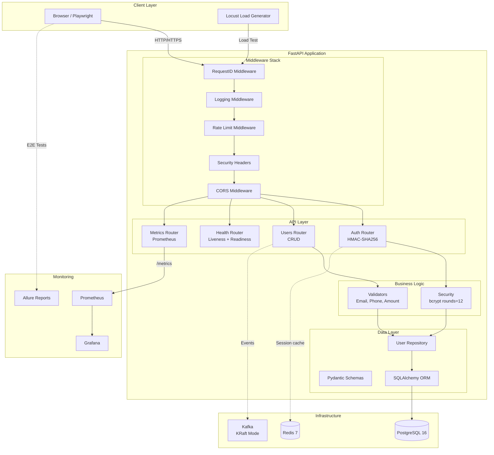
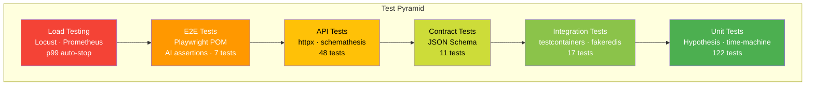

<div align="center">

# 🎯 QUALIX

**QA-платформа production-уровня для мониторинга деградации API и UI**

[🇬🇧 English](README.md) | [🇷🇺 Русский](README.ru.md)

[](https://github.com/ssrjkk/qualix/actions)
[](https://codecov.io/gh/ssrjkk/qualix)
[](https://python.org)
[](https://pytest.org)
[](https://github.com/astral-sh/ruff)
[](https://github.com/PyCQA/bandit)
[](LICENSE)

[Быстрый старт](#-быстрый-старт) • [Архитектура](#-архитектура) • [Тесты](#-слои-тестирования) • [Документация](#-документация)

**Сергей Ситников** · QA Automation Engineer · [Telegram](https://t.me/ssrjkk)

</div>

---

## 📋 Что внутри?

qualix — это не просто набор тестов. Это **полноценный продукт** для мониторинга деградации API и UI с production-grade архитектурой.

<table>
<tr>
<td width="50%">

### 🏗️ Приложение
- FastAPI + HMAC-SHA256 аутентификация
- bcrypt (rounds=12, OWASP)
- Rate limiting + Security headers
- Prometheus метрики
- Kubernetes-ready

</td>
<td width="50%">

### 🧪 Тестирование
- 317 тестов, 100% coverage
- Полная тест-пирамида
- Hypothesis property-based
- Playwright E2E + AI assertions
- Locust нагрузочное тестирование

</td>
</tr>
</table>

## 🚀 Быстрый старт

```bash
# 1. Клонируем
git clone git@github.com:ssrjkk/qualix.git && cd qualix

# 2. Устанавливаем зависимости
make setup

# 3. Поднимаем инфраструктуру (опционально)
make up

# 4. Запускаем тесты
make test          # полный suite
make cov           # отчёт по coverage
```

<details>
<summary><b>📦 Что устанавливается?</b></summary>

- ✅ Все зависимости из `pyproject.toml`
- ✅ Pre-commit хуки (ruff, mypy, bandit)
- ✅ Playwright chromium браузер
- ✅ 20+ команд в Makefile

</details>

## 💡 Варианты использования

### Для QA Engineers
**Изучайте современные практики тестирования:**
- Изучите полную тест-пирамиду: unit → integration → API → contract → E2E → load
- Реальные примеры `Hypothesis` property-based тестирования (500+ кейсов на каждый валидатор)
- `Playwright` Page Object Model с AI-powered assertions
- `pytest-benchmark` для обнаружения performance регрессий

**Используйте как эталонную реализацию:**
- Копируйте паттерны для своих проектов: factory_boy, time-machine, fakeredis
- Адаптируйте плагин flaky test tracker для автоматического создания GitHub Issues
- Переиспользуйте чеклист security hardening (см. [SECURITY.md](SECURITY.md))

### Для DevOps Engineers
**Production-ready паттерны деплоя:**
- Kubernetes манифесты с HPA, rolling updates, health probes
- Prometheus + Grafana monitoring stack (дашборд включён)
- Docker multi-stage build со security scanning (Trivy)
- 17-job CI/CD pipeline с quality gates

**Infrastructure as code примеры:**
- `infra/k8s/` — deployment, service, HPA, secrets
- `infra/prometheus.yml` — scrape configs для app + зависимостей
- `infra/grafana/` — предрасконфигурированный дашборд с 6 панелями

### Для разработчиков
**Best practices FastAPI:**
- Clean architecture: repository pattern, dependency injection, layered structure
- Middleware stack: RequestID, logging, rate limiting, security headers
- HMAC-SHA256 аутентификация с constant-time verification
- bcrypt хеширование паролей (OWASP compliant)

**Type-safe код:**
- mypy strict mode включён
- Pydantic валидация для всех request/response моделей
- Decimal для денежных значений (без проблем с float precision)

### Для Security Researchers
**Реализация defense-in-depth:**
- Custom token auth с защитой от timing attacks
- Строгая политика паролей
- CORS per-environment (production: no origins, dev: localhost only)
- Rate limiting: sliding window, bounded memory
- Security headers на каждом response

**Аудируйте код:**
- Нет секретов в репозитории (только environment variables)
- Bandit SAST + Safety dependency scan в CI
- pre-commit hooks для обнаружения private keys
- См. [SECURITY.md](SECURITY.md) для полной security policy

## 🏛️ Архитектура



<details>
<summary><b>🔍 Детали компонентов</b></summary>

**Middleware Stack** (порядок выполнения):
1. `RequestIDMiddleware` — генерирует `X-Request-ID` для distributed tracing
2. `LoggingMiddleware` — structlog JSON логирование с request_id
3. `RateLimitMiddleware` — sliding window, 100 req/min per IP
4. `SecurityHeadersMiddleware` — X-Frame-Options, X-Content-Type-Options, и т.д.
5. `CORSMiddleware` — origins для каждого окружения

**API Endpoints**:
- `POST /api/v1/auth/login` — HMAC-SHA256 токен
- `GET/POST/PUT/DELETE /api/v1/users` — CRUD операции
- `GET /health` — liveness probe (k8s)
- `GET /health/ready` — readiness probe (k8s)
- `GET /metrics` — Prometheus метрики

</details>

## 🧪 Слои тестирования



| Слой | Тестов | Инструменты | Что валидирует |
|------|--------|-------------|----------------|
| **Unit** | 122 | pytest · Hypothesis · time-machine · benchmark | Валидаторы, модели, auth |
| **Integration** | 17 | testcontainers · fakeredis · SQLite | Repository pattern, DB ops |
| **API** | 48 | httpx · factory_boy · schemathesis | CRUD, auth flows, OpenAPI fuzzing |
| **Contract** | 11 | JSON Schema | API контракты, security constraints |
| **E2E** | 7 | Playwright POM · AI assertions | Login flow, UI взаимодействия |
| **Load** | - | Locust · Prometheus · p99 auto-stop | Производительность, латентность |
| **Total** | **317** | | **100% coverage** |

<details>
<summary><b>🎯 Ключевые возможности тестирования</b></summary>

**Генерация данных**:
- `factory_boy` — `UserCreateFactory`, `UserPayloadFactory` с traits
- `Hypothesis` — 500+ property-based кейсов для валидаторов
- `Faker` — реалистичные тестовые данные

**Контроль времени**:
- `time-machine` — детерминированные тесты token expiry
- `pytest-benchmark` — performance регрессии для bcrypt, token ops

**Изоляция**:
- `fakeredis` — Redis тесты без Docker
- `SQLite fallback` — тесты без PostgreSQL
- `AsyncMock` — моки для unit тестов

**AI-powered**:
- `Claude Sonnet` — семантические UI assertions в E2E
- `Flaky tracker` — автоматическое создание GitHub Issues

</details>

## 🛡️ Безопасность

qualix реализует **defense-in-depth** подход:

<table>
<tr>
<td width="33%">

### 🔐 Аутентификация
- HMAC-SHA256 токены
- Constant-time verification
- bcrypt (rounds=12)
- Строгая политика паролей

</td>
<td width="33%">

### 🌐 Сеть
- Security headers
- CORS per-environment
- Rate limiting (100 req/min)
- Request ID tracking

</td>
<td width="33%">

### 🏗️ Инфраструктура
- Bandit SAST
- Safety dependency scan
- Trivy container scan
- Dependabot weekly

</td>
</tr>
</table>

<details>
<summary><b>📊 Security чеклист</b></summary>

**Аутентификация**:
- ✅ Custom HMAC-SHA256 токены с constant-time сравнением
- ✅ bcrypt хеширование паролей (OWASP compliant)
- ✅ Строгая политика паролей: uppercase + lowercase + digit + special character
- ✅ Отклонение пустых токенов

**Сеть**:
- ✅ Security headers: X-Frame-Options, X-Content-Type-Options, Referrer-Policy, Permissions-Policy
- ✅ CORS per-environment (production: no origins, dev: localhost only)
- ✅ Rate limiting: 100 req/min per IP, sliding window, bounded memory

**Данные**:
- ✅ Нет секретов в коде (environment variables + sealed-secrets)
- ✅ Decimal для денег (PaymentRequest.amount использует Decimal)
- ✅ Защита от SQL injection (SQLAlchemy ORM)

**CI/CD**:
- ✅ Bandit SAST + Safety dependency scan
- ✅ Trivy container scanning
- ✅ Dependabot weekly updates
- ✅ pre-commit hooks (bandit + detect-private-key)

Подробнее: [SECURITY.md](SECURITY.md)

</details>

## 📊 Мониторинг

```bash
# Prometheus метрики
curl http://localhost:8080/metrics

# Grafana дашборд
open http://localhost:3000  # admin:changeme

# Allure отчёты
open http://localhost:4040
```

**Grafana дашборд** включает:
- HTTP request rate по статусам
- Percentiles латентности (p50, p95, p99)
- Error rate (5xx)
- Версия приложения и окружение

## 📚 Документация

| Ресурс | Описание |
|--------|----------|
| [CONTRIBUTING.md](CONTRIBUTING.md) | Как внести вклад |
| [SECURITY.md](SECURITY.md) | Политика безопасности |
| [CHANGELOG.md](CHANGELOG.md) | История изменений |
| [docs/adr/](docs/adr/) | Architecture Decision Records |
| [docs/case-studies/](docs/case-studies/) | Постмортемы и выводы |

### ADR (Architecture Decision Records)

- [001](docs/adr/001-custom-token-vs-jwt.md) — Почему custom tokens вместо JWT
- [002](docs/adr/002-sqlite-fallback-for-tests.md) — Почему SQLite fallback
- [003](docs/adr/003-bcrypt-for-passwords.md) — Почему bcrypt вместо SHA-256
- [004](docs/adr/004-fakeredis-in-tests.md) — Почему fakeredis вместо моков
- [005](docs/adr/005-json-schema-contracts-vs-pact.md) — Почему JSON Schema вместо Pact

## 🔧 Команды

<details>
<summary><b>📋 Все команды Makefile</b></summary>

```bash
# Тесты
make test              # полный suite
make test-unit         # unit + coverage
make test-integration  # integration (fakeredis + SQLite)
make test-api          # API + schemathesis
make test-contract     # JSON Schema contracts
make test-e2e          # Playwright (требует make up)
make test-load         # Locust 30s smoke

# Coverage
make cov               # term + html + xml
make cov-open          # открыть html в браузере

# Качество
make lint              # ruff + mypy
make fmt               # авто-форматирование
make security-scan     # SAST + dependency scan

# CI
make ci                # lint + unit + integration + api + contract

# Окружение
make setup             # полная настройка (deps + pre-commit)
make install           # только зависимости
make pre-commit        # проверить все файлы

# Утилиты
make changelog         # обновить CHANGELOG из git-cliff
make schema            # регенерировать openapi.json
make clean             # удалить артефакты
```

</details>

## 🚢 CI/CD

**17-job GitHub Actions pipeline**:

```
lint → unit (+codecov) → integration → api → contract → e2e → allure → 
coverage-badge → docker → staging → load → release
```

- ✅ **Coverage enforcement** — `fail_under=80`, branch coverage
- ✅ **Zero-downtime deploy** — k8s RollingUpdate + `maxUnavailable=0`
- ✅ **HPA** — автомасштабирование по CPU/Memory (min=2, max=10)
- ✅ **Dependabot** — weekly updates для pip, Docker, GitHub Actions

<details>
<summary><b>🔍 Kubernetes манифесты</b></summary>

```yaml
infra/k8s/
├── namespace.yaml
├── deployment.yaml      # RollingUpdate, liveness/readiness probes
├── service.yaml         # ClusterIP
├── hpa.yaml             # CPU + memory autoscaling
├── configmap.yaml       # Environment variables
└── sealed-secret.yaml   # Encrypted secrets (kubeseal)
```

</details>

## 📦 Структура проекта

<details>
<summary><b>🌳 Показать дерево</b></summary>

```
qualix/
├── app/                          # FastAPI SUT
│   ├── api/                      # Routes: auth, users, health, metrics
│   ├── models/                   # SQLAlchemy ORM + Pydantic schemas
│   ├── repositories/             # Data access layer
│   ├── services/                 # Business logic validators
│   ├── middleware.py             # RequestID · Logging · RateLimit · Security
│   ├── security.py               # bcrypt password hashing
│   ├── logging_config.py         # structlog structured logging
│   ├── dependencies.py           # FastAPI DI
│   └── config.py                 # pydantic-settings
│
├── tests/
│   ├── unit/                     # 122 tests (Hypothesis, time-machine)
│   ├── integration/              # 17 tests (testcontainers, fakeredis)
│   ├── api/                      # 48 tests (httpx, schemathesis)
│   ├── contract/                 # 11 tests (JSON Schema)
│   ├── e2e/                      # 7 tests (Playwright POM)
│   ├── load/                     # Locust + Prometheus
│   └── plugins/                  # Flaky tracker
│
├── infra/
│   ├── k8s/                      # Kubernetes manifests
│   ├── prometheus.yml            # Scrape configs
│   └── grafana/                  # Dashboard provisioning
│
├── docs/adr/                     # Architecture Decision Records
├── .github/workflows/ci.yml      # 17-job pipeline
├── docker-compose.yml            # 7 services
├── Makefile                      # 20+ commands
└── pyproject.toml                # Dependencies + tool configs
```

</details>

## 🤝 Как внести вклад

1. Форкните репозиторий
2. Создайте feature branch (`git checkout -b feature/amazing`)
3. Запустите тесты (`make ci`)
4. Закоммитьте изменения (`git commit -m 'feat: add amazing feature'`)
5. Запушьте (`git push origin feature/amazing`)
6. Откройте Pull Request

Подробнее: [CONTRIBUTING.md](CONTRIBUTING.md)

## 📄 Лицензия

MIT © [ssrjkk](https://github.com/ssrjkk)

---

<div align="center">

**⭐ Поставьте звезду, если проект был полезен!**

[GitHub](https://github.com/ssrjkk/qualix) · [Telegram](https://t.me/ssrjkk) · [Email](mailto:ray01lefe@gmail.com)

</div>
